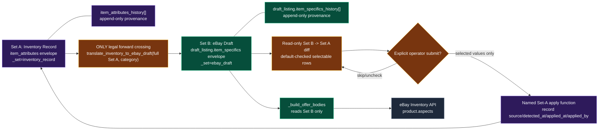
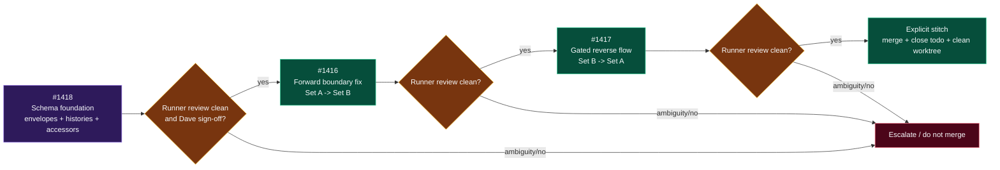

# TGW Field-Set Boundary and Delivery Pipeline — machine-readable companion

**Companion to:** [TGW-Field-Set-Boundary-and-Delivery-Pipeline.html](TGW-Field-Set-Boundary-and-Delivery-Pipeline.html)  
**Scope:** PP-LISTEDITOR-001; packets #1418 → #1416 → #1417  
**Purpose:** concise, parseable orientation for human and AI coding agents. The packet documents remain the implementation source of truth.

## Non-negotiable model

```yaml
field_sets:
  inventory_record:
    label: "Set A — Inventory Record"
    storage: "item_attributes"
    envelope:
      _set: inventory_record
      version: integer
      updated_at: ISO-8601 timestamp
      fields: "marketplace-agnostic fields/aspects"
    history: "item_attributes_history[]"
    access: "inventory_record accessor module only"

  ebay_draft:
    label: "Set B — eBay Draft"
    storage: "draft_listing.item_specifics"
    envelope:
      _set: ebay_draft
      version: integer
      updated_at: ISO-8601 timestamp
      fields: "eBay category-resolved aspects"
    history: "draft_listing.item_specifics_history[]"
    access: "eBay-draft specifics accessor module only"

boundaries:
  inventory_to_ebay:
    direction: "Set A -> Set B"
    legal_function: "translate_inventory_to_ebay_draft(full_inventory_set, category_id, cfg)"
    result: "full eBay item_specifics set"
  ebay_to_inventory:
    direction: "Set B -> Set A"
    legal_sequence:
      - "diff_ebay_draft_to_inventory(item)"
      - "read-only diff endpoint/UI"
      - "operator selects default-checked subset and explicitly submits"
      - "named Set-A apply function writes selected fields with provenance"
    automatic_promotion: forbidden

prohibitions:
  - "No local per-key merge, prefill fallback, or {**a, **b} spread crosses a set boundary."
  - "No generic PATCH passthrough writes either set."
  - "No ambiguous display value may blend Set A and Set B."
  - "eBay Inventory API push reads Set B only."
```



## Packet sequencing



## Implementation check before editing

1. Identify whether the code is operating **within Set A**, **within Set B**, or **crossing a boundary**.
2. Use the named accessor for the relevant set; do not index the raw envelope outside its accessor module.
3. For a cross-set action, find and use the named translation/diff/apply function. Do not recreate partial key logic.
4. Preserve append-only provenance history for every write.
5. For a new write into Set A from Set B, require explicit operator submission; no confidence threshold authorizes automatic promotion.
6. Keep the packet dependency order; reviewer evidence is not an automatic merge authorization.
